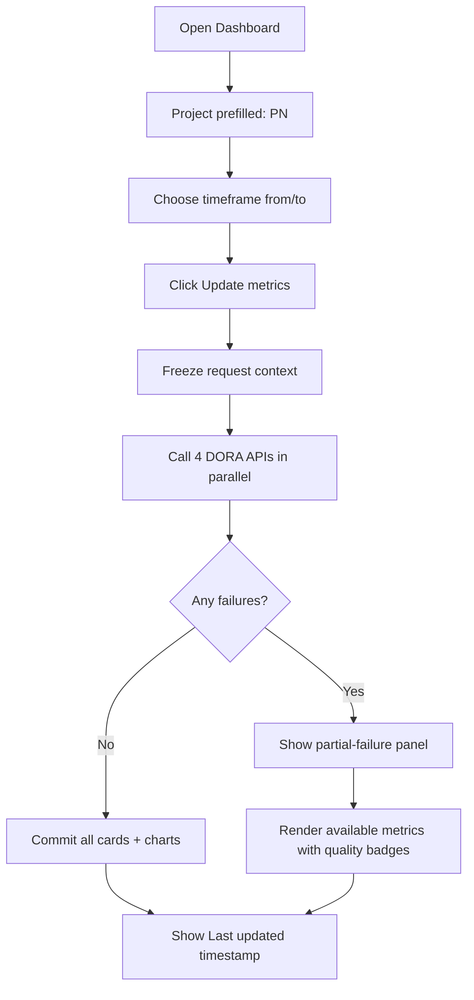
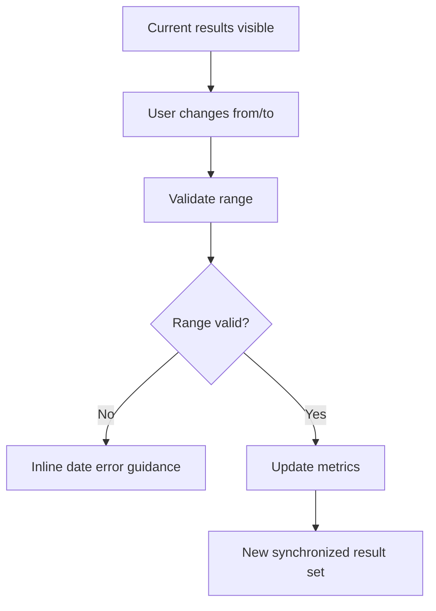

# UX Design Specification time-analyser

**Author:** mario
**Date:** 2026-04-13

## Executive Summary

### Project Vision
Build a fast, trustworthy DORA dashboard where an Engineering Manager selects one project and one timeframe, then receives all four DORA metrics in a single coordinated refresh: Deployment Frequency, Lead Time for Changes, Change Failure Rate, and MTTR.

### Target Users
- Engineering Managers monitoring team delivery health.
- Tech Leads preparing weekly/monthly performance reviews.
- Delivery stakeholders needing quick cross-metric trend snapshots.

### Key Design Challenges
- Keep the query model simple while metrics have different computational complexity.
- Prevent partial or stale visual states across metric cards.
- Show confidence and transparency for API latency and empty datasets.

### Design Opportunities
- Single “Request Context” panel for project + date range used by all metrics.
- Synchronized refresh and shared loading timeline for user trust.
- Clear metric storytelling with thresholds, trends, and drill-down links.

## Core User Experience

### Defining Experience
The core action is: “Set project and timeframe, then get all DORA metrics at once.”

The UX must optimize for this action:
- Minimal friction input controls.
- One clear “Update metrics” trigger.
- One coherent response state spanning all KPI cards and charts.

### Platform Strategy
- Primary platform: responsive web application.
- Input paradigm: mouse/keyboard first, touch-friendly controls.
- No offline mode required.
- URL query sync enabled for shareable dashboard state.

### Effortless Interactions
- Default `project = PN` prefilled.
- Default date range preset (last 30 days), with custom `from`/`to` picker.
- Single submit action updates all metric views.
- Keyboard submit from date control applies filters.

### Critical Success Moments
- User changes timeframe and sees all metric cards update together.
- User instantly understands when data is missing vs. loading vs. failed.
- User can trust that every card references the same project/time context.

### Experience Principles
- One context, one refresh, one truth.
- Show progress globally, not per widget chaos.
- Favor clarity over density.
- Never hide uncertainty: expose freshness and data completeness.

## Emotional Response Goals

### Desired Emotions
- Confidence: “These numbers are consistent and current.”
- Control: “I can quickly compare periods and focus the project.”
- Calm: “The dashboard is clear even when APIs are slow or empty.”

### Anti-Emotions to Avoid
- Distrust from mixed timestamps across cards.
- Anxiety from repeated spinner flicker and unstable layouts.
- Confusion from unaligned units or unexplained metric semantics.

## UX Pattern Analysis

### Chosen Patterns
- Control bar with sticky filter context (project + timeframe).
- KPI cards for primary values, chart strip for trend context.
- Empty states with actionable guidance (change range, verify project data).
- Inline “last updated” and request ID/timestamp for transparency.

### Rejected Patterns
- Auto-refresh on every keystroke in date controls.
- Per-card independent querying (breaks synchronized truth).
- Dense table-first layout for first screen.

## Inspiration and Direction

### Interaction Style
- Operational dashboard style, high legibility, medium information density.
- Intentional hierarchy: controls, KPI snapshot, trend details, diagnostics.

### Visual Tone
- Professional and crisp.
- Neutral base with semantic accent colors by metric category.

## Design System Strategy

### Foundation
- Reuse existing stack: Tailwind + shadcn/ui + Recharts.
- Build a small DORA-specific token layer for metric semantics.

### Semantic Tokens
- Deployment Frequency: success/throughput accent.
- Lead Time: latency accent.
- Change Failure Rate: risk accent.
- MTTR: recovery accent.

### Typography and Spacing
- Emphasize metric value readability first.
- Ensure consistent baseline for card headers and trend subtitles.

## Defining Experience Mechanics

### Request Context Model
All dashboard widgets must consume a single immutable request context object:
- `projectKey`: string (default `PN`)
- `from`: ISO date
- `to`: ISO date
- `requestedAt`: timestamp

### Synchronized Update Rule
When user clicks “Update metrics”:
1. Freeze current request context.
2. Trigger all four metric API requests in parallel.
3. Render unified global loading state.
4. Commit all responses together.
5. If one or more fail, show partial failure panel while still displaying available results with clear labels.

### Data Freshness Rule
Each result group displays:
- Context signature: `PN · from → to`
- Last updated timestamp
- Per-metric data quality badge (`ok`, `partial`, `empty`, `error`)

## Visual Foundation

### Color Roles
- Background: low-contrast neutral surfaces.
- Primary text: high-contrast neutral.
- Metric accents: four distinct semantic hues.
- Status colors: loading/info/success/warn/error.

### Accessibility Baselines
- Minimum contrast 4.5:1 for body text.
- Color is never the only status indicator.
- Keyboard focus visible on all controls and cards.

## Design Directions

### Direction A: Executive Snapshot
- Compact top KPI row.
- One comparative trend panel below.
- Best for weekly leadership sync.

### Direction B: Analytical Deep Dive
- KPI row + per-metric mini trend cards.
- Additional diagnostics panel for errors/coverage.
- Best for investigation and retrospective prep.

### Preferred Direction
Direction B, because the product goal includes trustworthy synchronized updates and troubleshooting clarity.

## User Journey Flows

### Journey 1: Request DORA Metrics

### Journey 2: Refine Timeframe Comparison

### Journey Patterns
- Global submit for multi-source data consistency.
- Shared loading and shared error narration.
- Stable layout skeleton to prevent content jumping.

### Flow Optimization Principles
- Keep the control bar always visible.
- Avoid hidden dependencies between widgets.
- Preserve previous values until new synchronized commit is ready.

## Component Strategy

### Core Components
- `DoraFilterBar`
  - `ProjectSelect` (default `PN`)
  - `DateRangePicker` (`from`, `to`)
  - `UpdateMetricsButton`
- `DoraGlobalStatusBanner`
  - loading/progress, partial failure summary, last update
- `DoraMetricCard`
  - title, value, unit, trend delta, quality badge
- `DoraTrendPanel`
  - trend lines or bars aligned to current context
- `DoraDiagnosticsPanel`
  - failed endpoints, retry CTA, help text

### Interaction Contracts
- `UpdateMetricsButton` disabled only during active synchronized request.
- Retry action reuses the last frozen context.
- Changing filters does not auto-fetch until explicit submit.

## UX Consistency Patterns

### Input and Validation
- Validate `from <= to` immediately.
- Keep date format consistent and locale-aware in display.

### Loading and Error
- One global loader for first fetch and manual refresh.
- Soft per-metric fallback if one endpoint fails.
- Explicit copy for empty data: “No records found in selected range.”

### Units and Formatting
- Deployment Frequency: number + period label.
- Lead Time and MTTR: hours/days with clear unit.
- Change Failure Rate: percentage with numerator/denominator hint.

## Responsive and Accessibility Strategy

### Responsive Layout
- Desktop: filter bar + 4-card row + trend/diagnostic split.
- Tablet: 2x2 KPI grid, stacked lower panels.
- Mobile: single-column cards, collapsible diagnostics.

### Accessibility
- All controls reachable in logical tab order.
- Live region announces global refresh completion.
- Error summary links to relevant diagnostic details.

## Implementation-Ready UX Acceptance Criteria
- User can request metrics by setting project and `from/to` range.
- `projectKey` defaults to `PN` on first load.
- All metrics refresh in one synchronized interaction.
- Dashboard communicates loading, partial failure, and empty states clearly.
- Every rendered value is explicitly tied to the active request context.
- UX remains usable and readable on desktop, tablet, and mobile.
